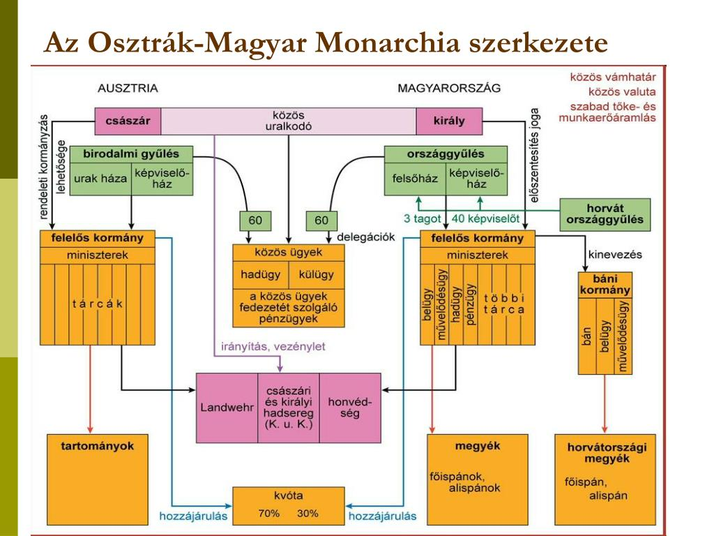

# **Bevezetés**

## **Történelmi Elhelyezés**

A téma Magyarország történetének **1867 és 1918 közötti korszakát**, a **dualizmus korát** öleli fel. Ez az időszak az **1867-es osztrák-magyar kiegyezéssel** kezdődött, amely egy új államjogi berendezkedést, az **Osztrák-Magyar Monarchiát** hozta létre. A korszakot a polgári átalakulás felgyorsulása, a gyors gazdasági modernizáció és az összetett belpolitikai viszonyok jellemezték, melyeket alapvetően a kiegyezéshez való viszony határozott meg.

## **Központi Problémafelvetés**

A központi kérdés a következő: **Hogyan tudott a dualizmus rendszere közel fél évszázadon át politikai stabilitást biztosítani egy olyan országban, ahol a politikai életet alapvetően meghatározó kiegyezés elfogadottsága folyamatos vita tárgya volt?**

## **A Kifejtés Vázlata**

1.  Bemutatjuk az Osztrák-Magyar Monarchia államszerkezetét és a magyar belpolitika alapvető kereteit.
2.  Elemezzük a pártrendszert, a kormánypártok és az ellenzék viszonyát, kiemelve a közjogi kérdés meghatározó szerepét.
3.  Áttekintjük a korszak legfontosabb politikai eseményeit és válságait, amelyek próbára tették a rendszer stabilitását.

# **Kifejtés**

## **Kulcsinformációk és Definíciók**

- **Dualizmus:** Kétközpontú állam, amelyben Ausztria és Magyarország belpolitikailag önálló, de közös uralkodó és közös ügyek (külügy, hadügy, pénzügy) kapcsolják össze őket.
- **Kiegyezés (1867):** Az a törvénycsomag, amely létrehozta az Osztrák-Magyar Monarchiát, rendezve a két ország közjogi és gazdasági viszonyát.
- **Közös ügyek:** A külügy, a hadügy és az ezek fedezetét biztosító pénzügy, melyeket a két parlament által választott **delegációk** és közös miniszterek irányítottak.
- **Kvóta:** A közös ügyek finanszírozásának aránya, melyet tízévente újratárgyaltak. Kezdetben Ausztria 70%-ot, Magyarország 30%-ot vállalt, ami a gazdasági fejlettségbeli különbségeket tükrözte.
- **Horvát-magyar kiegyezés (1868):** A magyarországi kiegyezés "kistestvére", amely Horvátország széleskörű területi és politikai autonómiáját biztosította a Magyar Királyságon belül.

## **A Téma Részletes Elemzése**

### **Kiváltó Okok és Előzmények**

- **A neoabszolutizmus kudarca:** Az **1848-49-es forradalom és szabadságharc** leverése után bevezetett osztrák önkényuralom (Bach-korszak) hosszú távon fenntarthatatlannak bizonyult.
- **Külső nyomás:** Ausztria katonai vereségei (pl. **1859**, **1866**) és a német egységből való kiszorulása rákényszerítette a bécsi udvart a magyarokkal való megegyezésre.
- **Magyar reálpolitika:** A **Deák Ferenc** nevével fémjelzett magyar politikai elit felismerte, hogy az ország függetlensége és modernizációja a Habsburg-birodalom keretein belül reálisabban érhető el, mint egy újabb fegyveres felkeléssel.

### **Az Eseménysor Folyamata: A dualista politikai rendszer működése**

- **Az állam felépítése:**
  - **Kétközpontú (dualista) alkotmányos monarchia.**
  - **Közös uralkodó:** **Ferenc József** (Ausztriában császár, Magyarországon király).
  - **Önálló belpolitika:** Mindkét országnak saját parlamentje, kormánya és közigazgatása volt.
  - **Közös hadsereg:** A **K. u. K. (császári és királyi)** hadsereg, melynek főparancsnoka az uralkodó volt.
- **A magyar pártrendszer alapvető megosztottsága:**
  - A pártokat nem ideológiai (konzervatív-liberális), hanem **közjogi alapon** különböztették meg: a kiegyezéshez való viszonyuk alapján.
  - **Kormánypártok:** Elfogadták a kiegyezést, és annak keretein belül kívántak politizálni.
    - **Deák-párt:** A kiegyezést létrehozó párt, élén **Deák Ferenccel** és **Andrássy Gyulával**.
    - **Szabadelvű Párt (1875-1905):** A Deák-párt és a kiegyezést bizonyos kritikával elfogadó **Balközép Párt** egyesüléséből jött létre. A korszak legmeghatározóbb politikai ereje, mely 30 évig kormányzott. Vezetője a "generális"-ként emlegetett **Tisza Kálmán** volt (miniszterelnök: 1875-1890).
  - **Ellenzéki pártok:** Elutasították vagy alapjaiban kívánták módosítani a kiegyezést.
    - **Országos 48-as Párt / Függetlenségi Párt:** Mereven elutasították a kiegyezést, teljes függetlenséget és perszonáluniót (csak az uralkodó személye közös) követeltek.
    - **Balközép Párt:** Mérsékeltebb ellenzék, amely a közös ügyek megszüntetését szorgalmazta, de később beleolvadt a Szabadelvű Pártba.
- **A politikai stabilitás fenntartása:**
  - **A Szabadelvű Párt hosszú kormányzása:** **Tisza Kálmán** miniszterelnöksége alatt a párt erős parlamenti többséget biztosított, ami lehetővé tette a modern polgári állam kiépítését (rendőrség, csendőrség, közigazgatás modernizálása).
  - **Korlátozott választójog:** A cenzusos választójog (vagyoni és műveltségi feltételekhez kötött) a lakosság csak kis részének (kb. 6-7%-ának) biztosított szavazati jogot, ami kiszűrte a radikálisabb elemeket.
  - **Nyílt szavazás:** A nyílt szavazás rendszere lehetővé tette a kormány számára a választók befolyásolását és a hatalom megtartását.
- **A rendszer válságai:**
  - **Védelemvita:** Az 1900-as évek elején a hadseregfejlesztés kérdése éles konfliktust robbantott ki a kormány és az ellenzék között. Az ellenzék a magyar vezényleti nyelv és nemzeti jelképek bevezetését követelte, amit az uralkodó elutasított.
  - **Parlamenti obstrukció:** Az ellenzék a törvényhozás akadályozásával (vég nélküli beszédek) próbálta megbénítani a kormányt.
  - **1905-ös belpolitikai válság:** A Szabadelvű Párt vereséget szenvedett a választásokon, de a győztes ellenzéki koalíciót az uralkodó nem akarta kinevezni. Ez alkotmányos válsághoz vezetett, amit végül kompromisszummal oldottak meg.

### **Eredmények és Közvetlen Következmények**

- **Politikai stabilitás:** A dualista rendszer, minden belső feszültsége ellenére, közel 50 évnyi békés fejlődést és politikai nyugalmat biztosított Magyarország számára.
- **Modernizáció:** A stabil kormányzás lehetővé tette a polgári állam kiépítését, a gazdaság felzárkózását és a társadalom átalakulását.
- **A közjogi vita állandósulása:** A kiegyezés kérdése folyamatosan a belpolitika fókuszában maradt, megosztva a politikai elitet és a közvéleményt.

## **Hatásvizsgálat**

- **Közvetlen Következmények:**
  - Lezárult a neoabszolutizmus korszaka, és helyreállt a magyar alkotmányosság.
  - Magyarország a birodalmon belül egyenrangú fél lett, jelentős önállósággal.
- **Hosszú Távú Hatások:**
  - A közös hadsereg és külpolitika belesodorta az országot az **első világháborúba**, ami végül a Monarchia széteséséhez és a történelmi Magyarország összeomlásához vezetett.
  - A nemzetiségi kérdés megoldatlansága (az 1868-as nemzetiségi törvény liberális szelleme ellenére) a háborús vereséggel együtt a trianoni békediktátum egyik fő hivatkozási alapja lett.

# **Kontextus és Kritika**

## **Összefüggések és Párhuzamok**

- **1848-as örökség:** A dualizmus politikai pártjai folyamatosan az 1848-as követelésekhez mérték magukat. A Deák-párt az áprilisi törvények megvalósulását látta a kiegyezésben, míg a függetlenségi ellenzék a teljes szuverenitás feladását nehezményezte.
- **Európai nemzetállamok kora:** A dualizmus kora egybeesik az olasz és német egység létrejöttével. A Monarchia egy többnemzetiségű birodalomként próbált meg túlélni egy olyan korban, amikor a nemzetállami eszme dominált, ami belső feszültségekhez vezetett.

## **Eltérő Nézőpontok és Viták**

- **A kiegyezés értékelése:**
  - **Szükséges kompromisszum:** A korabeli és a későbbi történetírás egy része szerint a kiegyezés az adott történelmi helyzetben az egyetlen reális és előnyös megoldás volt, amely békét és fejlődést hozott.
  - **Nemzeti önfeladás:** Mások, különösen a függetlenségi ellenzék, az 1848-as elvek feladásának, a nemzeti szuverenitás csorbításának tekintették, ami az országot kiszolgáltatta az osztrák érdekeknek és a Habsburg-dinasztiának.

## **Örökség és Jelenkori Relevancia**

A dualizmus kora a modern Magyarország születésének időszaka. A korszak politikai vitái a szuverenitásról, a nemzeti érdekekről és az európai integrációról (birodalmi keretek között) ma is aktuális kérdéseket vetnek fel. A korszakban kiépült intézményrendszer (pl. közigazgatás, igazságszolgáltatás) alapjai a mai napig meghatározzák a magyar állam működését.

# **Összefoglalás**

## **A Fő Érvek Összegzése**

A dualizmus kori Magyarország politikai rendszerét a kiegyezés által létrehozott kettősség jellemezte: egyrészt egy stabil, a modernizációt levezénylő kormányzati hatalom, másrészt egy, a rendszer alapjait folyamatosan megkérdőjelező ellenzék. A stabilitást a korlátozott választójogon alapuló parlamenti rendszer és egy erős, hosszú ideig kormányzó párt (Szabadelvű Párt) biztosította. A feszültségeket a közjogi vita és a megoldatlan nemzetiségi kérdés okozta, amelyek a rendszer bukásához vezettek.

## **Válasz a Központi Kérdésre**

A dualizmus rendszere azért tudott közel fél évszázadon át stabilitást biztosítani, mert a kiegyezést támogató politikai elit sikeresen monopolizálta a hatalmat a korlátozott választójog és a parlamenti erőfölény révén, miközben az ország gazdasági és társadalmi modernizációja szélesebb rétegek számára is érzékelhető fejlődést hozott. A közjogi ellenzék kritikája ugyan állandó volt, de a rendszer megdöntésére nem volt ereje egészen az első világháború okozta külső sokkig.

## **Záró Perspektíva**

Az Osztrák-Magyar Monarchia és benne a dualista Magyarország a "boldog békeidők" szinonimájává vált, ám a felszín alatt rejlő politikai feszültségek végül egy világégésben törtek a felszínre, bizonyítva, hogy a kompromisszumokon alapuló stabilitás törékeny, ha nem képes kezelni a mélyben húzódó nemzeti és társadalmi konfliktusokat.
