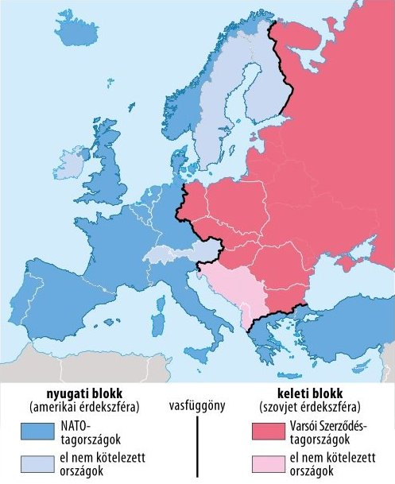

# **Bevezetés**

## **Történelmi Elhelyezés**

A téma a **második világháborút követő időszakra** fókuszál, amely **1945-től 1991-ig** tartott. Ezt a korszakot a két győztes szuperhatalom, a **kapitalista Amerikai Egyesült Államok** és a **kommunista Szovjetunió** globális szembenállása határozta meg. A háború utáni hatalmi vákuum és az ideológiai ellentétek egy új típusú, fegyveres összecsapás nélküli, de rendkívül feszült globális konfliktushoz, a **hidegháborúhoz** vezettek.

## **Központi Problémafelvetés**

Hogyan alakította át a második világháború utáni világrendet a két szuperhatalom (USA és Szovjetunió) ideológiai és hatalmi rivalizálása, és ez a szembenállás milyen konkrét konfliktusokon és eseményeken keresztül vezetett a világ polarizálódásához?

## **A Kifejtés Vázlata**

1.  A kétpólusú világrend kialakulásának okai és a szembenálló tömbök létrejötte.
2.  A hidegháború legfontosabb szakaszainak és konfliktusainak elemzése.
3.  A hidegháború következményei és a kétpólusú világrend felbomlása.

# **Kifejtés**

## **Kulcsinformációk és Definíciók**

- **Kulcsfogalmak:**

  - **Hidegháború:** A két szuperhatalom (USA, Szovjetunió) és szövetségi rendszereik közötti, közvetlen fegyveres összecsapás nélküli, de fegyverkezési versennyel, ideológiai harccal és helyi (ún. "forró") konfliktusokkal jellemezhető szembenállás (1947-1991).
  - **Kétpólusú (bipoláris) világrend:** A nemzetközi politika olyan struktúrája, ahol a hatalom két, egymással versengő központ (pólus) köré szerveződik.
  - **Vasfüggöny:** Winston Churchill által 1946-ban, a fultoni beszédében használt kifejezés, amely Európa politikai, katonai és ideológiai kettéosztottságát szimbolizálta a nyugati és a szovjet befolyási övezet között.
  - **Feltartóztatás (Containment):** Az USA Truman elnök által meghirdetett külpolitikája, amelynek célja a kommunizmus további terjedésének megakadályozása volt világszerte.
  - **Neokolonializmus (Újgyarmatosítás):** A volt gyarmati országok gazdasági és politikai függésben tartása a fejlett államoktól, a formális függetlenségük elnyerése után.

- **Kulcsszereplők:**

  - **Harry S. Truman:** Az USA elnöke, nevéhez fűződik a feltartóztatási politika (Truman-doktrína) és a Marshall-terv elindítása.
  - **Joszif Sztálin:** A Szovjetunió diktátora, a kelet-európai szovjet blokk kiépítője.
  - **Winston Churchill:** Nagy-Britannia volt miniszterelnöke, aki fultoni beszédével először hívta fel a figyelmet a szovjet terjeszkedés veszélyére.
  - **Nyikita Hruscsov:** Sztálin utódja, nevéhez fűződik a desztalinizáció és a "békés egymás mellett élés" politikája, de a kubai rakétaválság is.
  - **John F. Kennedy:** Az USA elnöke a kubai rakétaválság idején.

- **Meghatározó Dátumok / Időszakok:**
  - **1947:** A Truman-doktrína és a Marshall-terv meghirdetése.
  - **1948-1949:** A berlini blokád és Németország kettéosztásának kezdete.
  - **1949:** A NATO és a KGST megalakulása, a szovjet atombomba elkészülése, a két német állam (NSZK, NDK) létrejötte.
  - **1950-1953:** A koreai háború, a hidegháború első fegyveres konfliktusa.
  - **1955:** A Varsói Szerződés megalakulása (válaszul az NSZK NATO-tagságára).
  - **1961:** A berlini fal felépítése.
  - **1962:** A kubai rakétaválság, a nukleáris háború veszélyének csúcspontja.
  - **1989:** A berlini fal leomlása, a kelet-európai rendszerváltások kezdete.
  - **1991:** A Szovjetunió felbomlása, a hidegháború vége.

## **A Téma Részletes Elemzése**

### **Kiváltó Okok és Előzmények**

- **Ideológiai ellentét:** A **nyugati, liberális demokráciák és a piacgazdaság** álltak szemben a **szovjet típusú kommunista diktatúrával és a tervgazdálkodással**. Ez az alapvető különbség már a második világháború alatt is feszültséget okozott a szövetségesek között.
- **Hatalmi vákuum Európában:** A náci Németország és szövetségeseinek veresége után hatalmi űr keletkezett Közép- és Kelet-Európában. A Szovjetunió a Vörös Hadsereg által felszabadított (és megszállt) területeken kommunista bábkormányokat segített hatalomra, létrehozva a **keleti blokkot**.
- **Bizalmatlanság a szövetségesek között:** A háború végi konferenciákon (Jalta, Potsdam) felszínre kerültek az ellentétek. Az USA és Nagy-Britannia gyanakodva figyelte a szovjet terjeszkedést, míg a Szovjetunió egy ellenséges, kapitalista bekerítéstől tartott.
- **Az atombomba monopóliuma:** Az USA 1945-ös atomfegyver-monopóliuma katonai fölényt biztosított számára, ami tovább növelte a szovjet bizalmatlanságot, és ösztönözte a saját nukleáris programjuk felgyorsítását.

### **Az Eseménysor Folyamata**

**1. A tömbök kialakulása (1947-1955):**

- **A "vasfüggöny" leereszkedése:** A Szovjetunió Kelet-Európában (Lengyelország, Magyarország, Csehszlovákia stb.) felszámolta a többpártrendszert és kiépítette a kommunista diktatúrákat (szalámipolitika, kékcédulás választások).
- **Amerikai reakció:**
  - **Truman-doktrína (1947):** Az USA katonai és gazdasági segítséget ígért minden országnak, amelyet a kommunista terjeszkedés fenyeget (konkrétan: Görögország és Törökország támogatása).
  - **Marshall-terv (1947):** Gazdasági segélyprogram a háború sújtotta európai országok újjáépítésére, célja a gazdasági stabilitás megteremtése és a kommunizmus vonzerejének csökkentése volt. A Szovjetunió saját magának és csatlós államainak megtiltotta a segély elfogadását.
- **Németország kérdése:**
  - **Berlini blokád (1948-49):** A nyugati zónákban bevezetett valutareformra válaszul Sztálin lezárta a Nyugat-Berlinbe vezető szárazföldi utakat. Az USA **légihíddal** látta el a várost közel egy éven át, a blokád végül kudarcot vallott.
  - **Két Németország:** A konfliktus eredményeként 1949-ben létrejött a nyugati **Német Szövetségi Köztársaság (NSZK)** és a szovjet zónából a **Német Demokratikus Köztársaság (NDK)**.
- **Katonai szövetségek létrejötte:**
  - **NATO (1949):** Az Észak-atlanti Szerződés Szervezete az USA vezetésével létrehozott nyugati katonai-védelmi szövetség.
  - **Varsói Szerződés (1955):** A Szovjetunió és a keleti blokk országainak katonai szövetsége. Létrehozását közvetlenül az váltotta ki, hogy az **NSZK-t felvették a NATO-ba**.

**2. A hidegháború "forró" konfliktusai és válságai:**

- **Koreai háború (1950-1953):** A szovjetek által támogatott Észak-Korea megtámadta az USA által támogatott Dél-Koreát. A háborúba kínai és ENSZ (döntően amerikai) csapatok is beavatkoztak. A konfliktus fegyverszünettel zárult, amely visszaállította a háború előtti határokat a 38. szélességi fok mentén.
- **Kubai rakétaválság (1962):** A Szovjetunió atomrakétákat telepített Kubába, az USA közvetlen közelébe. Kennedy elnök tengeri blokád alá vonta Kubát. A világ az atomháború szélére sodródott. Végül Hruscsov visszavonta a rakétákat, cserébe az USA nyilvánosan ígéretet tett Kuba inváziójának elkerülésére, és titokban kivonta saját rakétáit Törökországból.
- **Vietnámi háború (kb. 1955-1975):** A kommunista Észak-Vietnam (Szovjetunió és Kína támogatásával) és a dél-vietnámi partizánok (Vietkong) harcoltak a Dél-Vietnami Köztársaság (USA támogatásával) ellen. A hosszú háború hatalmas amerikai presztízsveszteséggel és végül 1975-ben Észak-Vietnam győzelmével, az ország kommunista egyesítésével zárult.
- **Szovjet invázió Afganisztánban (1979):** A szovjet beavatkozás egy kommunista bábkormány támogatására elhúzódó gerillaháborúhoz vezetett, amelyet az USA (a mudzsahedinek felfegyverzésével) támogatott. Ez a konfliktus a Szovjetunió "vietnámi háborújává" vált, és jelentősen hozzájárult a szovjet gazdaság kimerüléséhez.

### **Eredmények és Közvetlen Következmények**

- **A világ két ellenséges táborra szakadása:** A NATO és a Varsói Szerződés mentén kialakult egy katonailag, gazdaságilag és ideológiailag is szembenálló kétpólusú világ.
- **Fegyverkezési verseny és a "Terror Egyensúlya":** Mindkét szuperhatalom óriási összegeket költött hadserege fejlesztésére. Kialakult a **kölcsönös elrettentés (MAD - Mutually Assured Destruction)** doktrínája: mivel mindkét fél képes volt a másik teljes megsemmisítésére még egy ellene irányuló első csapás után is, ez paradox módon visszatartotta őket a közvetlen háborútól.
- **Helyi háborúk:** A szuperhatalmak a "harmadik világban" (Ázsia, Afrika, Latin-Amerika) vívták meg konfliktusaikat (proxy háborúk), helyi erőket támogatva.
- **A gyarmati rendszer felbomlása:** A hidegháborús versengés felgyorsította a gyarmati rendszer felszámolását (dekolonizáció), mivel mindkét szuperhatalom igyekezett a frissen függetlenné váló országokat a saját befolyási övezetébe vonni.

## **Hatásvizsgálat**

- **Közvetlen Következmények:**
  - **Európa kettéosztottsága:** A vasfüggöny évtizedekre elvágta egymástól Kelet- és Nyugat-Európát, korlátozva az utazást, a kereskedelmet és a kulturális kapcsolatokat.
  - **Technológiai verseny:** A katonai rivalizálás (pl. rakétatechnológia) hatalmas lökést adott a tudományos-technikai fejlődésnek, amelynek egyik leglátványosabb eleme az **űrverseny** volt (Szputnyik-1, Gagarin, Holdra szállás).
- **Hosszú Távú Hatások:**
  - **A Szovjetunió összeomlása:** A fegyverkezési verseny gazdaságilag kimerítette a Szovjetuniót. A merev tervgazdaság képtelen volt felvenni a versenyt a nyugati technológiai és életszínvonal-beli fejlődéssel, ami végül a rendszer belső összeomlásához vezetett.
  - **Az USA egyedüli szuperhatalommá válása:** A hidegháború végével az USA maradt az egyetlen globális szuperhatalom, ami egy **egypólusú világrendet** hozott létre az 1990-es és 2000-es években.
  - **Tartós regionális konfliktusok:** A hidegháborús beavatkozások számos máig tartó konfliktus alapjait fektették le (pl. Korea megosztottsága, instabilitás a Közel-Keleten és Afganisztánban).

# **Kontextus és Kritika**

## **Összefüggések és Párhuzamok**

- **A "Harmadik Világ" és az El Nem Kötelezettek:** A függetlenné váló országok (pl. India, Jugoszlávia, Egyiptom) egy része megpróbált kimaradni a tömbök harcából, és létrehozták az **El Nem Kötelezettek Mozgalmát**, bár a valóságban sokan kényszerültek valamelyik oldalhoz közeledni.
- **Gazdasági integráció:** A hidegháborús megosztottság párhuzamos gazdasági integrációkat hozott létre: Nyugaton az **Európai Gazdasági Közösség (az EU elődje)**, Keleten pedig a **Kölcsönös Gazdasági Segítség Tanácsa (KGST)**.

## **Eltérő Nézőpontok és Viták**

- **A felelősség kérdése (Historiográfia):**
  - **Hagyományos (ortodox/nyugati) nézőpont:** A hidegháborúért elsősorban a **szovjet terjeszkedés és Sztálin agresszív politikája** a felelős. Az USA csak védekezett a demokrácia védelmében.
  - **Revizionista nézőpont:** (1960-as évektől, főleg amerikai baloldali történészek): Az **amerikai gazdasági imperializmus** ("dollárdiplomácia") kényszerítette védekezésre a Szovjetuniót, hogy piacokat szerezzen az amerikai tőkének.
  - **Poszt-revizionista nézőpont:** A levéltárak megnyitása utáni konszenzus. A hidegháború a **kölcsönös félreértések, a bizalmatlanság és a biztonsági dilemmák** elkerülhetetlen következménye volt. Nem egyetlen fél gonoszsága, hanem a hatalmi logika és az ideológiai inkompatibilitás vezetett a konfliktushoz.

## **Örökség és Jelenkori Relevancia**

A hidegháború öröksége máig meghatározó:

- **NATO:** A szervezet ma is létezik, és keleti bővítése (a volt Varsói Szerződés tagjaival) folyamatos feszültséget generál Oroszországgal.
- **Nukleáris fegyverek:** A hidegháborús fegyverkezésből visszamaradt hatalmas nukleáris arzenál továbbra is globális biztonsági kockázat.
- **"Új hidegháború":** A 21. század geopolitikai feszültségei (USA-Kína vetélkedés, Oroszország-Nyugat konfliktus) kapcsán gyakran merül fel a hidegháborús analógia, bár a gazdasági összefonódások ma sokkal erősebbek.

# **Összefoglalás**

## **A Fő Érvek Összegzése**

A kétpólusú világrend a második világháború utáni hatalmi átrendeződés és a két győztes szuperhatalom - az USA és a Szovjetunió - közötti kibékíthetetlen ideológiai ellentét következtében jött létre. Ez a szembenállás egy globális, évtizedekig tartó fegyverkezési és politikai versenyt, a hidegháborút eredményezte, amely Európa kettéosztásán túl helyi háborúkon keresztül formálta a világpolitikát. A konfliktus végül a Szovjetunió gazdasági kimerülésével és összeomlásával zárult.

## **Válasz a Központi Kérdésre**

A két szuperhatalom rivalizálása alapjaiban formálta át a világrendet azáltal, hogy a világot két, egymással mereven szembenálló katonai, gazdasági és ideológiai tömbre osztotta. Ez a polarizáció konkrét eseményeken - mint a berlini blokád, a koreai és vietnámi háború, valamint a kubai rakétaválság - keresztül mélyült el, ahol a globális nukleáris megsemmisülés kockázata (a terror egyensúlya) paradox módon stabilizálta a rendszert a közvetlen nagyhatalmi háború elkerülésével.

## **Záró Perspektíva**

A hidegháború története egyben figyelmeztetés arra, hogy az ideológiai merevség és a nagyhatalmi bizalmatlanság hogyan sodorhatja a világot a katasztrófa szélére, miközben a korszak lezárása bizonyította, hogy a gazdasági hatékonyság és a politikai szabadság hosszú távon erősebb fegyvernek bizonyulhat a puszta katonai erőnél.
