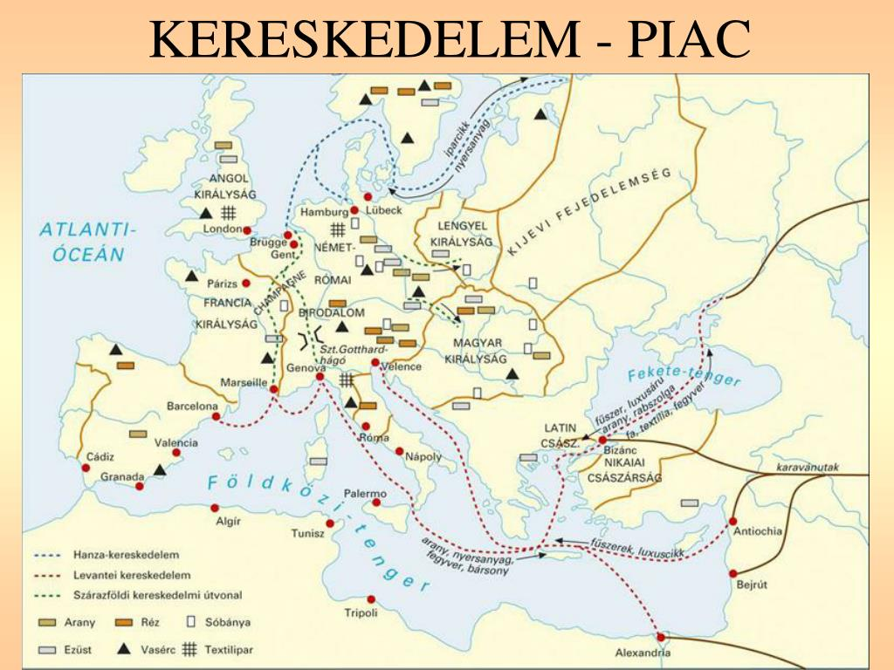

# **Bevezetés**

## **Történelmi Elhelyezés**

A középkori városfejlődés az **érett középkor (XI-XIII. század)** meghatározó jelensége. A kora középkor hanyatlása után ez az időszak a gazdasági és demográfiai fellendülés kora volt. A mezőgazdasági forradalom (pl. nehézeke, háromnyomásos gazdálkodás) élelmiszer-felesleget teremtett, ami lehetővé tette, hogy a népesség egy része elszakadjon a földműveléstől és kizárólag iparral és kereskedelemmel foglalkozzon. Magyarországon ez a folyamat nagyjából egy évszázad késéssel, elsősorban a **XIII. századtól**, a tatárjárás után gyorsult fel.

## **Központi Problémafelvetés**

Hogyan vezetett az érett középkor gazdasági és társadalmi átalakulása egy új típusú, önkormányzattal rendelkező település, a **szabad város** létrejöttéhez, és milyen jellegzetességekkel bírt ez az új entitás Európában és a Magyar Királyságban?

## **A Kifejtés Vázlata**

1.  A városok újjászületésének gazdasági és társadalmi okai.
2.  A középkori város általános jellemzői: társadalom, gazdaság és autonómia.
3.  A magyarországi városfejlődés sajátosságai és eltérései a nyugat-európai modelltől.

# **Kifejtés**

## **Kulcsinformációk és Definíciók**

- **Városi önkormányzat (kommuna):** A város lakóinak közössége, amely kiváltságok (privilégiumok) révén jogot szerzett a saját belső ügyeinek intézésére, mint a szabad bíróválasztás, az egyösszegű adózás és a saját igazgatás.
- **Céh:** Egyazon szakmát űző kézművesek érdekvédelmi szervezete, amely szabályozta a termelés minőségét, mennyiségét, az árakat és az utánpótlást (inas-, legény-, mesterképzés).
- **Patrícius:** A leggazdagabb, jellemzően távolsági kereskedelemmel foglalkozó polgárok rétege, akik a városi tanácsot és a legfőbb tisztségeket a kezükben tartották.
- **Plebs:** A városi lakosság polgárjoggal nem rendelkező, alkalmi munkákból élő alsó rétege.
- **Hospes (vendég):** Nyugat-Európából érkező telepesek a középkori Magyarországon, akiket a királyok kiváltságokkal (személyes szabadság, adókedvezmények) csábítottak az országba a gazdaság fellendítése érdekében.
- **Civitas vs. Oppidum:**
  - **Szabad királyi város (civitas):** Fallal körülvett, a királynak közvetlenül alárendelt, teljes önkormányzattal rendelkező város.
  - **Mezőváros (oppidum):** Földesúri joghatóság alatt álló, fallal nem rendelkező, korlátozottabb autonómiájú, de piaccal és bizonyos kiváltságokkal bíró település.

## **A Téma Részletes Elemzése**

### **Kiváltó Okok és Előzmények**

- **Mezőgazdasági forradalom:**
  - A **nehézeke** és a **szügyhám** elterjedése növelte a szántás hatékonyságát.
  - A **kétnyomásos gazdálkodást** felváltotta a **háromnyomásos**, ami a megművelt terület növelését és a termésbiztonságot eredményezte.
- **Demográfiai robbanás:** A jobb és biztosabb táplálkozás következtében Európa lakossága a XI-XIII. században megduplázódott (kb. 38-ról 75 millióra).
- **Felesleg és kereskedelem:**
  - A mezőgazdasági árutermelés felesleget hozott létre.
  - Újraindult a **pénzforgalom** és a távolsági kereskedelem (levantei és Hanza útvonalak).
- **Ipar és mezőgazdaság szétválása:** A lakosság egy része már nem a földből, hanem kézműves termékek előállításából és eladásából élt meg, ami speciális központokat, városokat igényelt.

### **Az Eseménysor Folyamata**

**1. A Nyugat-Európai Város Jellemzői:**

- **Küzdelem a kiváltságokért:** A városok lakói (polgárok) közösségekbe, **kommunákba** szerveződtek, hogy kiváltságokat harcoljanak vagy vásároljanak ki földesuruktól (legyen az király, püspök vagy nemes).
- **Városi önkormányzat jogai:**
  - **Szabad bíróválasztás** és saját bíróság.
  - **Saját adószedés** (a földesúr felé egy összegben adóztak).
  - **Szabad plébánosválasztás.**
  - **Árumegállító jog:** Az idegen kereskedőket kötelezték árujuk eladására a város piacán.
- **Társadalmi felépítés:**
  - **Patriciátus:** A városi elitet alkotó távolsági kereskedők.
  - **Polgárság zöme:** Céhekbe tömörült kézművesmesterek.
  - **Plebs:** Napszámosok, szolgák, inasok, akik nem rendelkeztek polgárjoggal.
- **A "városi levegő szabaddá tesz" elve:** Az a jobbágy, aki egy évet és egy napot a város falain belül töltött, felszabadult földesúri kötöttségei alól.

**2. A Magyarországi Városfejlődés Sajátosságai:**

- **Királyi alapítás:** Míg Nyugaton a városok "alulról" jöttek létre, Magyarországon a városiasodás motorja a **királyi hatalom** volt. Az uralkodók adományoztak kiváltságokat, hogy gazdasági és katonai támaszokat hozzanak létre.
- **A hospesek szerepe:** A tatárjárás után IV. Béla és utódai tömegesen hívtak be nyugati telepeseket (főleg németeket), akik magukkal hozták a városi életformát, a szakértelmet és a jogszokásokat.
- **A városhálózat kettőssége:**
  - **Szabad királyi városok:** Stratégiailag fontos helyeken (pl. határvédelem, bányavidékek) jöttek létre. Ide tartoztak a **tárnoki városok** (Buda, Kassa, Pozsony stb.) és a **bányavárosok** (Körmöcbánya, Selmecbánya).
  - **Mezővárosok:** Típusosan magyar településforma. Jelentős gazdasági központokká nőhették ki magukat (pl. Debrecen, Kecskemét), de jogilag a földesúr joghatósága alatt maradtak, és nem illette meg őket a falépítés joga.

### **Eredmények és Közvetlen Következmények**

- Megjelent egy új, rendi kiváltságokkal nem, de gazdasági erővel és szabadságjogokkal rendelkező társadalmi csoport, a **polgárság**.
- A feudális, önellátó gazdálkodást felváltotta az **árutermelésen és pénzgazdálkodáson** alapuló rendszer.
- A városok a királyi hatalom fontos szövetségeseivé váltak a feudális nagybirtokosokkal (bárókkal) szemben, mivel adóikkal és katonai erejükkel támogatták a központi hatalmat.

## **Hatásvizsgálat**

- **Közvetlen Következmények:** A városok a tudás és az innováció központjaivá váltak, megjelentek az első **egyetemek**. A gótikus stílusú, hatalmas katedrálisok a városi polgárság gazdagságát és öntudatát hirdették.
- **Hosszú Távú Hatások:** A városi autonómia és a polgári mentalitás (szorgalom, tőkefelhalmozás) teremtette meg a **kapitalizmus** és a **modern polgári demokráciák** alapjait. A középkorban kialakult városhálózat máig meghatározza Európa településszerkezetét.

# **Kontextus és Kritika**

## **Összefüggések és Párhuzamok**

- A városfejlődés szorosan összekapcsolódik az **invesztitúraharcokkal**. A pápasággal küzdő császárok és királyok gyakran támaszkodtak a városokra a püspökökkel és hűbéruraikkal szemben, cserébe kiváltságokat adományozva nekik.
- A **keresztes hadjáratok** óriási lökést adtak a távolsági kereskedelemnek, különösen az itáliai városállamok (Velence, Genova) gazdagodtak meg a Szentfölddel folytatott forgalmon.

## **Eltérő Nézőpontok és Viták**

A magyar történetírásban sokáig vita tárgya volt a **mezővárosok** megítélése. A régebbi felfogás inkább "jobbágyfalunak" tekintette őket, hangsúlyozva földesúri függésüket. A modernebb, funkcionális szemlélet (pl. Kubinyi András munkássága alapján) szerint azonban ezek valódi városi funkciókat töltöttek be: piaci központok voltak, jelentős iparos és kereskedő réteggel rendelkeztek, és autonómiájuk, ha korlátozott is, de létezett. E nézőpont szerint a magyar városhálózatot a királyi városok és a mezővárosok együttese alkotta.

## **Örökség és Jelenkori Relevancia**

A középkori városok legfontosabb öröksége az **önkormányzatiság** eszméje. A mai helyi önkormányzatok működése, a választott testületek és a helyi autonómia mind a középkori városi kiváltságokban gyökereznek. A városok által megteremtett gazdasági és kulturális sokszínűség ma is a társadalmi fejlődés motorja.

# **Szintézis**

## **A Fő Érvek Összegzése**

A középkori városfejlődés a XI. századi gazdasági fellendülés közvetlen következménye, amely egy új társadalmi réteget, a polgárságot hívta életre. Ezek a fallal körülvett, kiváltságokkal védett közösségek az árutermelés, a pénzgazdálkodás és a kultúra központjaivá váltak. Míg Nyugat-Európában a városok alulról szerveződő kommunaként vívták ki jogaikat, Magyarországon a folyamatot a királyi hatalom irányította a hospesek betelepítésével és a privilégiumok adományozásával.

## **Válasz a Központi Kérdésre**

Az érett középkor gazdasági fellendülése teremtette meg a feltételeket egy specializálódott, nem agrár népesség eltartásához, amely a városokban koncentrálódott. Ezek a közösségek a földesúri hatalommal szemben kiharcolt vagy a királytól kapott kiváltságok révén egyedülálló jogi és gazdasági autonómiára tettek szert. Ez az új entitás Európa-szerte a polgári társadalom és a pénzgazdálkodás bázisa lett, Magyarországon pedig a királyi hatalom megerősítésének és az ország modernizálásának kulcsfontosságú eszköze.

## **Záró Perspektíva**

A középkori város nem csupán egy gazdasági központ volt, hanem egy forradalmian új társadalmi és politikai tér, amely megkérdőjelezte a feudális rend merev hierarchiáját, és elvetette azokat a magokat, amelyekből a modern Európa megszületett.
