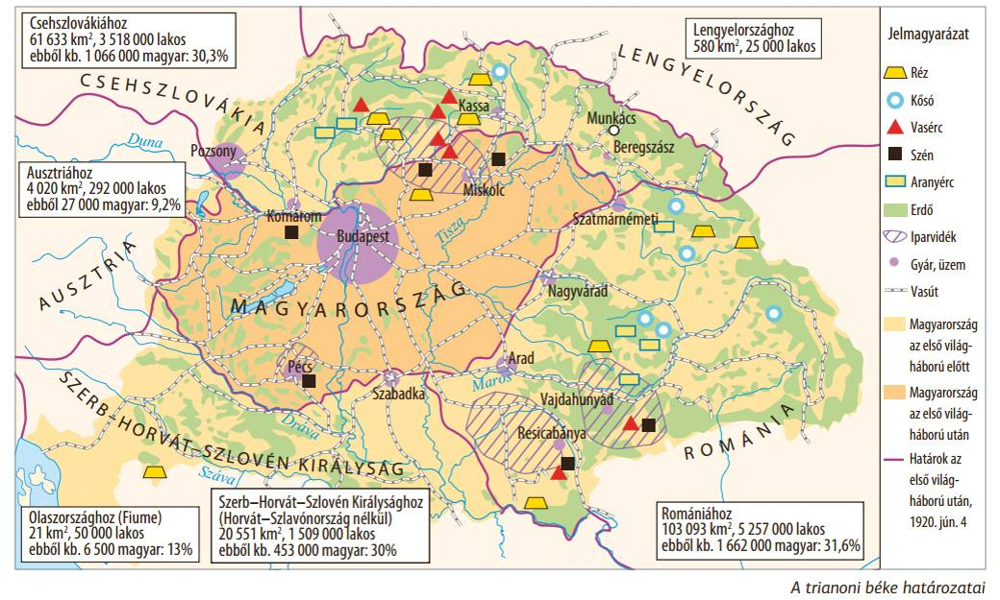

# **Bevezetés**

## **Történelmi Elhelyezés**

A vizsgált időszak a magyar történelem **Horthy-korszaka (1920-1944)**, azon belül is a **Bethlen István nevével fémjelzett konszolidációs periódus (1921-1931)**. Ezt a korszakot alapvetően meghatározta az első világháborús vereség és az azt követő **trianoni békeszerződés traumája**, amely a magyar külpolitika elsődleges céljává a **revíziót**, azaz a béke felülvizsgálatát tette.

## **Központi Problémafelvetés**

A tétel központi kérdése: **Hogyan tette a trianoni békeszerződés által létrehozott gazdasági szerkezet sebezhetővé Magyarországot, és milyen azonnali sokkot okozott a Bethlen István által felépített stabilizációnak a nagy gazdasági világválság kirobbanása 1929-1930-ban?**

## **A Kifejtés Vázlata**

1.  Először a Trianon utáni Magyarország gazdasági és társadalmi szerkezetének alapvető, **strukturális problémáit** vizsgáljuk.
2.  Ezt követően elemezzük a **világgazdasági válság becsapódását** és annak 1930-ig érezhető konkrét hatásait a magyar gazdaságra és társadalomra.
3.  Végül értékeljük, hogyan rendült meg a válság első hullámának hatására a bethleni konszolidáció rendszere.

# **Kifejtés**

## **Kulcsinformációk és Definíciók**

- **Trianoni békeszerződés (1920):** Az első világháborút lezáró béke, amelynek értelmében Magyarország elvesztette területének kétharmadát, lakosságának több mint felét, nyersanyagforrásainak és vasúthálózatának jelentős részét.
- **Revízió:** A trianoni békeszerződés felülvizsgálatára, a területi veszteségek visszafordítására irányuló politika, a Horthy-kor külpolitikájának legfőbb mozgatórugója.
- **Konszolidáció:** **Bethlen István** miniszterelnökségének (1921-1931) időszaka, amelynek célja a háború és a forradalmak utáni politikai és gazdasági helyzet stabilizálása volt (pl. Népszövetségi kölcsön, 1924).
- **Agrárolló:** A mezőgazdasági termények és az iparcikkek árai közötti különbség növekedése. A válság alatt az agrártermékek ára drasztikusan zuhant, míg az iparcikkeké kevésbé, ami a mezőgazdaságból élők elszegényedéséhez vezetett.

- **Kulcsszereplők:**
  - **Horthy Miklós:** Magyarország kormányzója, a korszak névadója.
  - **Bethlen István:** Miniszterelnök (1921-1931), a Trianon utáni konszolidáció megteremtője. Rendszere a gazdasági világválság hatására kezdett meginogni 1930-ra.

## **A Téma Részletes Elemzése**

### **Kiváltó Okok és Előzmények: A Trianon Utáni Sérülékeny Szerkezet**

Trianon és az Osztrák-Magyar Monarchia felbomlása egy torz, aránytalan gazdasági szerkezetet hagyott hátra, amely a bethleni konszolidáció sikerei ellenére is sebezhető maradt.

- **Piacvesztés és dezintegráció:** A legnagyobb sokkot az **50 milliós, egységes monarchiabeli piac elvesztése** jelentette. A magyar mezőgazdaság és ipar elvesztette hagyományos, vámmentes felvevőpiacait, és a szomszédos utódállamok (kisantant) protekcionista gazdaságpolitikájával, sőt vámháborúival kellett szembenéznie.
- **Nyersanyag- és feldolgozóipari diszharmónia:** Az ország elvesztette nyersanyagforrásainak (erdők, só-, vasérc- és szénbányák) túlnyomó részét, miközben a feldolgozókapacitások (pl. a túlméretezett budapesti malomipar, gépipar) az új határokon belül maradtak. Ez drága alapanyag-behozatalra kényszerítette az ipart.
- **Infrastrukturális káosz:** A Budapest-központú, sugaras szerkezetű vasúthálózatot az új határok önkényesen átvágták, megbénítva a határ menti régiók közlekedését és a keresztirányú kereskedelmet.
- **Társadalmi feszültségek:**
  - Az elcsatolt területekről kb. 400 ezer **menekült** érkezett (jelképükké váltak a vagonlakók), ami súlyos szociális és elhelyezkedési gondokat okozott.
  - A **földkérdés** megoldatlan maradt; a nagybirtokrendszer konzerválódott, így a vidéki lakosság jelentős része (az agrárszegénység) föld nélkül vagy törpebirtokon élt.

### **Az Eseménysor Folyamata: A Válság Első Hulláma (1929-1930)**

Bár az 1929-es New York-i tőzsdekrach közvetlenül nem érintette a magyar tőzsdét, a válság tovagyűrűző hatásai 1930-ra teljes erővel elérték Magyarországot, elsősorban a külföldi hitelek elapadásán és az agrárexport összeomlásán keresztül.

- **Agrárválság:** A válság **túltermelési válságként** jelentkezett a nemzetközi agrárpiacokon. A magyar export gerincét adó **búza világpiaci ára összeomlott**.
  - Az agrárolló szélesre nyílt: a gazdák terményeiket egyre olcsóbban tudták csak eladni, miközben a vásárolt iparcikkek ára alig csökkent.
  - Ez a folyamat a mezőgazdasági termelők tömeges eladósodásához vezetett. A vidéki lakosság vásárlóerejének visszaesése magával rántotta a belső piacot is.
- **Ipari válság kezdete:** A belső kereslet csökkenése miatt az ipari termelés is hanyatlani kezdett.
  - A mezőgazdasági gépeket gyártó üzemek és a nehézipar megrendelései drasztikusan estek.
  - Megkezdődött a munkaidő-csökkentés és az elbocsátás, 1930 végére a **munkanélküliség** már érezhetően nőtt a városokban, mivel ekkor még nem létezett állami munkanélküli segély.

### **Eredmények és Közvetlen Következmények 1930 Végére**

A válság első másfél éve még nem döntötte romba a teljes rendszert, de a hitelforrások elapadása és az exportpiacok beszűkülése halálos sebet ejtett a bethleni konszolidáción.

- **A konszolidáció megingása:** Az évtizeden át sikeresnek tűnő, külföldi hitelekre és stabil agrárkivitelre épülő gazdasági modell alapjaiban rendült meg. A kormányzat mozgástere a hitelcsapok elzáródásával megszűnt.
- **Társadalmi elégedetlenség:** Az elszegényedő parasztság és a növekvő városi munkanélküliség miatt a feszültségek kiéleződtek. Ennek leglátványosabb jele az **1930. szeptember 1-jei budapesti tüntetés** volt, ahol a tömeg összecsapott a rendőrséggel.
- **Politikai bizonytalanság:** Bár Bethlen István ekkor még hivatalban maradt, kormánya népszerűsége zuhanni kezdett. A gazdaság lefelé tartó spirálba került, előrevetítve az 1931-es pénzügyi összeomlást és a kormányfő későbbi lemondását.

# **Kontextus és Kritika**

## **Összefüggések és Párhuzamok**

A magyarországi válság nem elszigetelt jelenség volt, hanem a globális depresszió része. Azonban a Trianon utáni **sérülékeny, egyoldalúan agrárexport-orientált gazdasági szerkezet** sokkal védtelenebbé tette az országot az áringadozásokkal szemben, mint a fejlettebb, diverzifikáltabb ipari államokat. A magyar gazdaság sorsa szinte egyetlen termék, a búza világpiaci árfolyamán múlt.

## **Eltérő Nézőpontok és Viták**

A korszak problémáinak okairól már ekkor is két fő narratíva létezett:

1.  **A korabeli hivatalos álláspont:** Eszerint a magyar gazdaság minden bajának **kizárólagos oka Trianon**. A megoldást is egyedül a revízióban látták, ami gyakran elfedett más, belső strukturális problémákat (pl. az elavult birtokszerkezetet).
2.  **Modern történészi értékelés:** Ez az álláspont elismeri Trianon sokkhatását, de hangsúlyozza, hogy számos probléma a **dualizmus korából öröklődött**. A Monarchia egységes piacának elvesztése és a tőkehiány legalább akkora csapás volt, mint maguk a határmódosítások, és a válság pont ezeket a rejtett gyengeségeket hozta a felszínre.

# **Összefoglalás**

## **A Fő Érvek Összegzése**

A Horthy-kori Magyarország a bethleni konszolidáció ellenére egy Trianon által **strukturálisan meggyengített** és a külföldi hitelektől, valamint az agrárkiviteltől kritikusan függő gazdaság maradt. Ezt a rendkívül sebezhető rendszert érte el a világválság első hulláma, amely 1930-ra az agrárium összeomlásával és a belső piac beszűkülésével fenyegette a tíz év alatt elért viszonylagos stabilitást.

## **Válasz a Központi Kérdésre**

A trianoni békeszerződés egy olyan gazdasági kényszerpályát hozott létre, amelyben Magyarország túlságosan is kiszolgáltatottá vált a nemzetközi piacoknak. A nagy gazdasági világválság 1929-1930-as első hulláma ezért okozott aránytalanul nagy sokkot: **pont az ország gazdaságának legfontosabb pillérét, az agrárkivitelt rántotta magával**, és ezzel 1930 végére visszafordíthatatlanul megrendítette a Bethlen-kormány pozícióját.

## **Záró Perspektíva**

1930 végén Magyarország egy súlyos gazdasági depresszió kezdetén állt: a bethleni rendszer társadalmi bázisa (a gazdák és a középosztály) megingott, a szociális feszültségek (1930. szept. 1.) pedig előrevetítették a következő évek radikalizálódó belpolitikáját.
