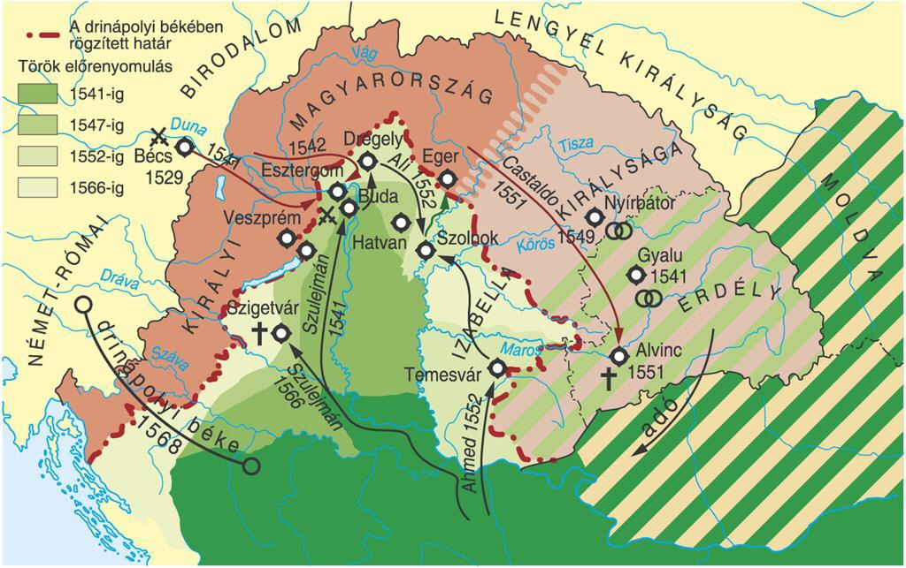

# **Bevezetés**

## **Történelmi Elhelyezés**

A mohácsi csata a **kora újkor** elején, a **Jagelló-kor** (1490–1526) végén zajlott. Ezt az időszakot Magyarországon a **központi hatalom meggyengülése**, a főúri pártok közötti viszálykodás és a déli végvárrendszer pénzhiány miatti elhanyagolása jellemezte. Európában eközben a **Habsburgok és Franciaország** vetélkedése (itáliai háborúk), valamint a **reformáció** kezdete kötötte le a nagyhatalmak figyelmét, ami Magyarország végzetes külpolitikai elszigetelődéséhez vezetett. Az **Oszmán Birodalom** I. (Nagy) Szulejmán vezetésével terjeszkedésének csúcspontján volt, és Magyarországot a Bécs és Nyugat-Európa felé vezető hadjáratok kulcsfontosságú felvonulási területének tekintette.

## **Központi Problémafelvetés**

Miért vezetett egyetlen, alig néhány órás csata a középkori, egységes Magyar Királyság összeomlásához és az ország több mint 150 éves megosztottságához?

## **A Kifejtés Vázlata**

1.  A csatához vezető belső (politikai, gazdasági) és külső (geopolitikai) okok feltárása.
2.  A mohácsi ütközet lefolyásának, erőviszonyainak és a katonai vereség okainak elemzése.
3.  A csata közvetlen és hosszú távú következményeinek bemutatása: a kettős királyválasztástól Buda 1541-es elfoglalásáig.

# **Kifejtés**

## **Kulcsinformációk és Definíciók**

- **Kulcsfogalmak:**
  - **Jagelló-kor:** A központi hatalom gyengeségének és a rendi széthúzásnak a korszaka Magyarországon (1490-1526), II. Ulászló és II. Lajos uralkodása alatt.
  - **Végvárrendszer:** A déli határ (Duna–Száva vonal) védelmét szolgáló várak láncolata, amely a központi kincstár kiürülése miatt a 16. század elejére súlyosan meggyengült.
  - **Török hódoltság:** Az Oszmán Birodalom által elfoglalt és közigazgatásilag betagozott (vilajetekre osztott) magyarországi terület, amely Buda 1541-es elfoglalásával jött létre ténylegesen.
  - **Kettős királyválasztás:** II. Lajos halála után a magyar nemesség megosztottsága miatt két uralkodót választottak: a köznemesi párt Szapolyai Jánost, a főúri párt Habsburg Ferdinándot.
- **Kulcsszereplők:**
  - **II. Lajos:** Magyar és cseh király (1516-1526). Fiatalon került trónra, uralmát a belpolitikai káosz jellemezte. A csatából való menekülés közben a megáradt Csele-patakba fulladt.
  - **I. (Nagy) Szulejmán:** Az Oszmán Birodalom szultánja (1520-1566). A birodalom az ő uralkodása alatt élte fénykorát; célja a Magyar Királyság megtörése, majd Bécs elfoglalása volt.
  - **Tomori Pál:** Kalocsai érsek, alsó-magyarországi főkapitány, a magyar sereg egyik fővezére. A csata egyik legelszántabb támogatója, hősi halált halt az ütközetben.
  - **Szapolyai János:** Erdélyi vajda, az ország legnagyobb birtokosa. Seregével (kb. 10-15 ezer fő) nem érkezett meg időben a csatamezőre, később magyar királlyá választották.
  - **Habsburg Ferdinánd:** Osztrák főherceg, II. Lajos sógora. A Habsburg–Jagelló házassági szerződés alapján tartott igényt a trónra.
- **Meghatározó Dátumok:**
  - **1521:** Nándorfehérvár (Belgrád) eleste – a déli végvárrendszer kulcsának elvesztése megnyitotta az utat az ország belseje felé.
  - **1526. augusztus 29.:** A mohácsi csata napja.
  - **1541:** Buda török kézre kerülése (augusztus 29.), az ország három részre szakadásának tényleges kezdete.

## **A Téma Részletes Elemzése**

### **Kiváltó Okok és Előzmények**

- **Belső politikai okok:**

  - **Gyenge központi hatalom:** Mátyás halála után a rendek szándékosan gyenge uralkodókat választottak. A királyi jövedelmek (regálék) mintegy 70-80%-kal csökkentek Mátyás korához képest.
  - **Pártküzdelmek:** A Szapolyai János vezette "nemzeti" (köznemesi) párt és az udvari (Habsburg-orientált) arisztokrácia ellentéte megbénította az országgyűléseket és a honvédelmet.
  - **Katonai hanyatlás:** A zsoldos Fekete Sereget már II. Ulászló alatt feloszlatták. Az ország védelme a nemesi felkelésre (insurrectio) és a banderiális hadseregre épült, amely lassú és korszerűtlen volt.

- **Külső politikai okok:**
  - **Oszmán expanzió:** Szulejmán trónra lépésével a török külpolitika iránya Európa lett. Céljuk a Habsburgok európai hegemóniájának megtörése volt.
  - **Magyarország elszigetelődése:** A nyugati hatalmak (V. Károly császár és I. Ferenc francia király) háborúja miatt Magyarország segélykérései süket fülekre találtak. A pápa némi pénzbeli segélyt küldött, de ez kevés volt a felkészüléshez.
  - **Stratégiai összeomlás:** Nándorfehérvár 1521-es elvesztése után a határok védhetetlenné váltak.

### **Az Eseménysor Folyamata**

- **A hadseregek felvonulása:**

  - **Oszmán sereg:** Kb. 60 ezer reguláris katona (janicsárok, szpáhik) és jelentős tüzérség, kiegészülve segédcsapatokkal. Fegyelmezett, egységes vezetés alatt állt.
  - **Magyar sereg:** Kb. 25 ezer fő. A gyülekezés lassú volt, a vezetés megosztott (Tomori Pál és Szapolyai György). Két jelentős seregtest (Szapolyai János erdélyi hada és a horvát bán csapatai) nem érkezett meg.

- **A csata lefolyása (1526. augusztus 29.):**
  - **Magyar haditerv:** Mivel a törökök túlerőben voltak, Tomori egy mindent eldöntő, gyors nehézlovas rohammal akarta áttörni az ellenség centrumát, mielőtt azok teljesen hadrendbe állnak.
  - **A küzdelem:** A magyar jobbszárny és a centrum kezdetben sikeresen visszaszorította a ruméliai hadtestet.
  - **A fordulat:** Amikor a magyar lovasság elérte a török centrumot, a janicsárok pusztító sortüze és az összeláncolt ágyúk tüze megállította, majd felőrölte a rohamot. A szárnyakon a törökök bekerítették a magyarokat.
  - **Összeomlás:** A csata érdemi része alig másfél-két óra alatt lezajlott. A rendezetlen menekülés során a mocsaras területen rengetegen lelték halálukat.

### **Eredmények és Közvetlen Következmények**

- **Tragikus veszteségek:** A magyar sereg közel fele, kb. 14-15 ezer fő elesett. Odaveszett a politikai és egyházi elit jelentős része (2 érsek, 5 püspök, számos főúr), ami az államvezetés megbénulását okozta.
- **A király halála:** II. Lajos menekülés közben a Csele-patakba fulladt (a nehéz páncélzata miatt). Halála azonnali trónutódlási válságot okozott.
- **Buda kifosztása:** Szulejmán szeptemberben bevonult Budára, a várost kirabolta és felgyújtotta, de ekkor még nem hagyott helyőrséget, hanem októberben kivonult az országból.

## **Hatásvizsgálat**

- **Közvetlen Következmények:**

  - **Polgárháború (1526-1538):** A fehérvári országgyűlésen **Szapolyai Jánost**, a pozsonyi országgyűlésen **Habsburg Ferdinándot** választották királlyá. A két király hívei között véres belháború kezdődött.
  - **Török befolyás növekedése:** Szapolyai szorult helyzetében a szultánhoz fordult támogatásért, amivel (1529-től) vazallusi státuszba süllyesztette saját országrészét.

- **Hosszú Távú Hatások:**
  - **Az ország három részre szakadása (1541-től):** Szapolyai halála után (1540) a szultán, "védnökség" ürügyén, 1541-ben csellel elfoglalta Budát.
    1.  **Királyi Magyarország:** Nyugati és felvidéki területek, Habsburg-irányítás alatt (ütközőzóna).
    2.  **Hódoltság:** Az ország közepe (Duna-Tisza köze), közvetlen oszmán közigazgatás alatt.
    3.  **Erdélyi Fejedelemség:** Keleti területek, oszmán hűbéres, de belpolitikailag önálló állam.
  - **Társadalmi és gazdasági pusztulás:** Az állandósuló végvári harcok és a hadjáratok miatt az ország népessége stagnált, a Hódoltság területei elnéptelenedtek.

<!-- _[Ide a kép rövid leírása: Térkép, amely Magyarország három részre szakadását ábrázolja (Királyi Magyarország, Hódoltság, Erdélyi Fejedelemség).]_ -->

# **Kontextus és Kritika**

## **Összefüggések és Párhuzamok**

Mohács nem elszigetelt esemény, hanem az Oszmán Birodalom európai előretörésének (Rigómező, Nikápoly, Várna) logikus állomása volt. A csata rávilágított a feudális banderiális hadsereg elavultságára a modern, tűzfegyverekkel és állandó zsoldosokkal (janicsárok) rendelkező oszmán hadigépezettel szemben.

## **Eltérő Nézőpontok és Viták**

- **Szapolyai János szerepe:** A korabeli Habsburg-propaganda árulással vádolta Szapolyait a távolmaradása miatt. A mai történészi konszenzus szerint azonban nem szándékos késésről volt szó, hanem ellentmondásos parancsokról és a mozgósítás nehézségeiről.
- **A csata vállalásának kényszere:** Sokan vitatják, helyes volt-e megvívni a csatát a túlerővel szemben. A vezetés azonban attól tartott, hogy harc nélküli visszavonulás esetén a morál összeomlana, és a török akadálytalanul dúlná fel az országot, ráadásul a török könnyűlovasság miatt a rendezett visszavonulás is életveszélyes lett volna.

## **Örökség és Jelenkori Relevancia**

A "mohácsi vész" a magyar kollektív emlékezetben a **nemzethalál víziójának** és a széthúzás átkának szimbóluma. Ady Endre _"Nekünk Mohács kell"_ című verse is arra utal, hogy a nemzetet néha csak a tragédiák rázzák fel. Történelmi tanulsága, hogy a belső megosztottság és a geopolitikai realitások figyelmen kívül hagyása végzetes következményekkel járhat egy kisállam számára.

# **Összefoglalás**

## **A Fő Érvek Összegzése**

A mohácsi katasztrófa egy hosszú folyamat eredménye volt: a Jagelló-kor államszervezeti válsága, a gazdasági kimerülés és a külpolitikai elszigeteltség miatt Magyarország esélytelenül állt szemben a korabeli világ egyik legerősebb hadseregével. A vereséget súlyosbította a király halála, amely hatalmi űrt teremtett, lehetőséget adva az oszmán hódítás tartósulására.

## **Válasz a Központi Kérdésre**

Azért vezethetett egyetlen csata az ország összeomlásához, mert a Magyar Királyság szervezete ekkorra már "kívül-belül korhadt" volt. A mohácsi síkon nemcsak egy sereg semmisült meg, hanem az állam politikai és egyházi vezetése is lefejeződött. A vereség után hiányzott az az egységes politikai akarat és erő, amely megszervezhette volna az ellenállást, így az ország szükségszerűen a nagyhatalmak játékszerévé és hadszínterévé vált.

## **Záró Perspektíva**

1526. augusztus 29. a középkori magyar nagyhatalmi státusz végét és egy másfél évszázados, küzdelmes túlélési korszak kezdetét jelentette, amely alapjaiban rajzolta át a Kárpát-medence etnikai és politikai térképét.
