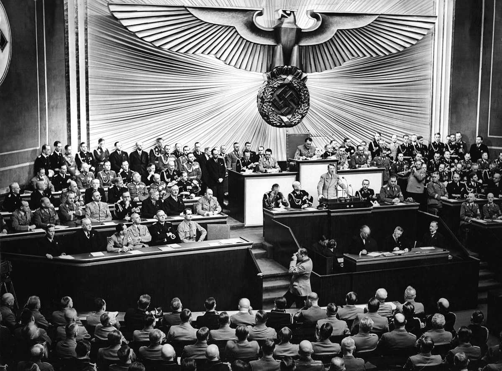

# **Bevezetés**

## **Történelmi Elhelyezés**

A téma a **két világháború közötti időszakban**, az **1930-as évek elején** helyezkedik el Németországban. Ezt a korszakot a **weimari köztársaság válsága** és a **nagy gazdasági világválság** pusztító hatásai jellemezték. A demokratikus intézményekbe vetett hit megrendülése és a mély társadalmi, gazdasági krízis teremtett táptalajt a szélsőséges, **totalitárius ideológiák**, így a nemzetiszocializmus megerősödésének.

## **Központi Problémafelvetés**

Hogyan volt képes egy korábban marginális politikai erő, a Nemzetiszocialista Német Munkáspárt (NSDAP) törvényes keretek között hatalomra jutni, majd rekordsebességgel felszámolni a demokráciát és kiépíteni egy totális diktatúrát?

## **A Kifejtés Vázlata**

1.  **Az út a hatalomig:** Bemutatjuk a weimari köztársaság bukásához vezető okokat és azokat a tényezőket, amelyek az NSDAP népszerűségének növekedéséhez vezettek.
2.  **A hatalomátvétel és a diktatúra kiépítése:** Elemezzük Hitler kancellári kinevezésétől a totális állam megszilárdulásáig tartó folyamat legfontosabb lépéseit.
3.  **A náci állam működése:** Részletezzük a náci rendszer ideológiai, gazdasági és társadalmi jellemzőit, valamint külpolitikai törekvéseit.

# **Kifejtés**

## **Kulcsinformációk és Definíciók**

- **Kulcsfogalmak:**
  - **Nemzetiszocializmus (nácizmus):** Szélsőjobboldali, totalitárius politikai ideológia, melynek központi elemei a fajelmélet (árja felsőbbrendűség), az antiszemitizmus, a vezérelv (Führerprinzip), az élettér-elmélet (Lebensraum) és az antidemokratizmus.
  - **Totális diktatúra:** Olyan államforma, ahol a hatalom egyetlen párt vagy személy kezében összpontosul, és az állam az élet minden területére (gazdaság, kultúra, magánélet) kiterjeszti ellenőrzését.
  - **Felhatalmazási törvény (1933):** Kulcsfontosságú törvény, amely a törvényhozó hatalmat a kormányra ruházta, ezzel gyakorlatilag felszámolva a parlamentáris demokráciát.
  - **Nürnbergi törvények (1935):** Faji alapú törvények, amelyek megfosztották a zsidókat német állampolgárságuktól és alapvető jogaiktól.
- **Kulcsszereplők:**
  - **Adolf Hitler:** Az NSDAP vezére (Führer), 1933-tól Németország kancellárja, majd diktátora.
  - **Paul von Hindenburg:** A weimari köztársaság elnöke, aki kinevezte Hitlert kancellárrá.
  - **Joseph Goebbels:** Propaganda miniszter, a náci ideológia terjesztésének agytrösztje.
  - **Heinrich Himmler:** Az SS és a Gestapo vezetője, a terrorgépezet és a holokauszt egyik fő irányítója.
- **Meghatározó Dátumok:**
  - **1933. január 30.:** Hitler kancellári kinevezése.
  - **1933. február 27.:** A Reichstag (parlament) felgyújtása, ami ürügyet szolgáltatott a polgári szabadságjogok felfüggesztésére.
  - **1934. június 30.:** "Hosszú kések éjszakája", leszámolás a párton belüli ellenzékkel (SA).
  - **1938. november 9-10.:** "Kristályéjszaka", országos pogrom a zsidók ellen.

## **A Téma Részletes Elemzése**

### **Kiváltó Okok és Előzmények**

- **A versailles-i békeszerződés (1919) hatásai:**
  - A német közvélemény **megalázónak** tartotta a béke feltételeit (területi veszteségek, jóvátétel, haderő korlátozása).
  - Elterjedt a **"tőrdöfés-legenda"**, miszerint a hadsereget a "hátország" (politikusok, zsidók, kommunisták) árulta el. Ez aláásta a demokratikus köztársaságba vetett bizalmat.
- **A weimari köztársaság instabilitása:**
  - A politikai rendszer **töredezett** volt, gyakori kormányválságok jellemezték.
  - A szélsőjobb (pl. Kapp-puccs) és a szélsőbal (pl. Spartacus-felkelés) is erőszakkal próbálta megdönteni a rendszert.
  - Az elnöki "szükségállapot-cikkely" (48. cikkely) lehetővé tette a parlament megkerülésével történő kormányzást, ami gyengítette a demokráciát.
- **A nagy gazdasági világválság (1929-től):**
  - Németországot különösen súlyosan érintette a válság, a munkanélküliség **drámai méreteket öltött** (több mint hatmillió fő).
  - A tömegek elégedetlensége és a kilátástalanság a **szélsőséges pártok**, a kommunisták és a nácik felé fordította a választókat.
- **A náci propaganda hatékonysága:**
  - Hitler **karizmatikus szónokként** minden társadalmi rétegnek azt ígérte, amire vágytak: munkát, rendet, a nemzeti büszkeség helyreállítását.
  - Egyszerű bűnbakokat kínáltak: a **zsidókat, kommunistákat** és a "novemberi bűnözőket".
  - Modern propagandaeszközöket és tömeggyűléseket használtak a mozgósításra.

### **Az Eseménysor Folyamata**

1.  **Választási sikerek:** A válság mélyülésével az NSDAP támogatottsága ugrásszerűen megnőtt. Míg 1928-ban csak 2,6%-ot értek el, 1932 júliusára **37,3%-kal a Reichstag legerősebb pártjává váltak**.
2.  **Hitler kancellári kinevezése (1933. január 30.):**
    - A konzervatív politikai elit (pl. von Papen) abban a hitben támogatta Hitler kinevezését, hogy "kordában tudják tartani" és fel tudják használni a baloldal ellen. Ez súlyos tévedésnek bizonyult.
    - Hindenburg elnök egy koalíciós kormány élére nevezte ki.
3.  **A diktatúra kiépítésének lépései (1933-34):**
    - **Reichstag felgyújtása (1933. február):** A kommunistákra fogott merénylet ürügyén **rendkívüli állapotot** vezettek be, felfüggesztve az alapvető polgári szabadságjogokat.
    - **Felhatalmazási törvény (1933. március):** A parlament lényegében lemondott saját jogköreiről, a kormány rendeleti úton kormányozhatott. Ezzel a **törvényesség látszatát fenntartva** számolták fel a demokráciát.
    - **"Gleichschaltung" (Egybehangolás):** Felszámolták a szakszervezeteket, betiltották a többi politikai pártot, létrehozva az **egypártrendszert**. Az állami és társadalmi szervezeteket a náci párt irányítása alá vonták.
    - **"Hosszú kések éjszakája" (1934. június):** Hitler az SS segítségével leszámolt a párton belüli riválisával, Ernst Röhmmel és az SA (Sturmabteilung) vezetésével, elnyerve ezzel a hadsereg (Wehrmacht) támogatását.
    - **A Führer megszületése (1934. augusztus):** Hindenburg halála után Hitler összevonta a kancellári és az elnöki tisztséget, felvéve a **"Vezér és Birodalmi Kancellár"** címet. A hadsereg és a köztisztviselők személyesen neki tettek hűségesküt.

### **Eredmények és Közvetlen Következmények**

- A weimari köztársaság demokratikus rendszere **teljesen megsemmisült**.
- Németország **totális, egypárti diktatúrává** alakult, ahol a hatalom Hitler kezében összpontosult.
- Megkezdődött a politikai ellenfelek, a zsidóság és más, "nemkívánatosnak" bélyegzett csoportok **szisztematikus üldözése**. Létrejöttek az első koncentrációs táborok (pl. Dachau).
- Az állami terror (Gestapo, SS) a megfélemlítés és az elnyomás legfőbb eszközévé vált.

## **Hatásvizsgálat**

- **Közvetlen Következmények:**
  - A munkanélküliség gyors csökkenése az állami (főleg hadiipari) megrendelések és közmunkaprogramok (pl. autópálya-építés) hatására.
  - A versailles-i békerendszer nyílt felrúgása: hadkötelezettség bevezetése, a Rajna-vidék remilitarizálása.
  - A társadalom militarizálása és totális ideológiai kontroll alá vonása (Hitlerjugend, propaganda).
- **Hosszú Távú Hatások:**
  - Az agresszív, élettér-elméleten alapuló külpolitika egyenes úton vezetett a **második világháború kitöréséhez (1939)**.
  - A faji alapú üldözés a **holokausztba**, az európai zsidóság és más kisebbségek szisztematikus kiirtásába torkollott.
  - Németország teljes háborús veresége, az ország kettéosztása és a nürnbergi per, amely elítélte a náci háborús bűnösöket.

# **Kontextus és Kritika**

## **Összefüggések és Párhuzamok**

A náci hatalomátvétel nem egyedi jelenség volt a korszakban. Párhuzamba állítható **Mussolini olaszországi fasiszta hatalomátvételével (1922)**, amely modellt szolgáltatott a totális állam kiépítéséhez (vezérkultusz, pártmilíciák). Ugyanakkor a **Sztálin vezette Szovjetunió** kommunista diktatúrájával is mutat közös vonásokat (egypártrendszer, terror, propaganda, koncentrációs táborok/gulag), bár az ideológiai alapvetésük ellentétes volt.

## **Eltérő Nézőpontok és Viták**

A történészek között vita tárgya, hogy Hitler hatalomra jutása elkerülhetetlen volt-e.

- **Determinisztikus nézőpont:** Ezen álláspont szerint a német történelem ("Sonderweg" - külön út) militarista, tekintélyelvű hagyományai, a versailles-i trauma és a gazdasági válság együttesen törvényszerűen vezettek Hitlerhez.
- **Strukturális/Funkcionális nézőpont:** Mások szerint a hatalomra jutás nem volt előre elrendelve. A konzervatív elit hibás döntései, a baloldali pártok (szociáldemokraták és kommunisták) megosztottsága és együttműködésének hiánya, valamint a gazdasági körülmények véletlen egybeesése mind hozzájárultak a nácik sikeréhez. Azt hangsúlyozzák, hogy Hitler sosem szerzett abszolút többséget szabad választásokon.

## **Örökség és Jelenkori Relevancia**

A nácizmus hatalomra jutásának története örök mementó arra, hogy a **demokratikus intézmények törékenyek**. Megmutatja, hogyan vezethet egy mély gazdasági és társadalmi válság, párosulva a demagóg propagandával és a politikai elit felelőtlen döntéseivel, egy diktatúra kialakulásához. Ma is figyelmeztető jel, hogy a politikai szélsőségek és a bűnbakképzés milyen veszélyeket rejt a társadalomra nézve.

# **Összefoglalás**

## **A Fő Érvek Összegzése**

A náci hatalomátvétel nem egyetlen ok, hanem több tényező - a versailles-i béke okozta nemzeti sérelem, a weimari köztársaság politikai instabilitása és a nagy gazdasági világválság - szerencsétlen együttállásának következménye volt. Az NSDAP hatékony propagandával és erőszakkal kihasználta a tömegek elégedetlenségét, miközben a konzervatív elit végzetesen alábecsülte Hitlert. A hatalom megszerzése után a törvényesség látszatát fenntartva, de valójában brutális terrorral és jogi manipulációval számolták fel a demokráciát.

## **Válasz a Központi Kérdésre**

A Nemzetiszocialista Párt azért juthatott törvényes úton hatalomra, mert a demokratikus rendszer válságát és a társadalom kétségbeesését kihasználva a legerősebb politikai erővé vált, amelyet a hatalmi elit - tévesen - egy átmeneti, kezelhető eszköznek tekintett a rend helyreállítására. A hatalom megszerzése után pedig a jogrendszer villámgyors és gátlástalan átalakításával, valamint a terror eszközeivel számolták fel a demokrácia intézményeit, mielőtt a társadalom vagy a politikai ellenfelek hatékonyan reagálhattak volna.

## **Záró Perspektíva**

A Harmadik Birodalom kiépülése a modern történelem egyik legsötétebb példája arra, hogyan válhat egy civilizált nemzet egy embertelen ideológia foglyává, ami végül egy világméretű katasztrófához és példátlan népirtáshoz vezetett.
